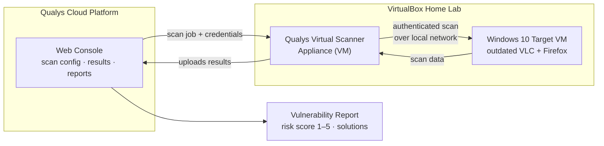

# Qualys Vulnerability Management Home Lab

Deployed a Qualys Virtual Scanner Appliance and used the Qualys Cloud
Platform to run an authenticated vulnerability scan against a Windows 10
machine, then remediated and re-scanned to verify the fix.

**Tools:** VirtualBox · Windows 10 · Qualys Cloud Platform · Qualys Virtual Scanner Appliance
**Skill areas:** Vulnerability scanning · risk-based prioritization · patch remediation · scan verification
**Career relevance:** Vulnerability Analyst · Security Engineer · SOC Analyst · Cloud Security Engineer

*Click any screenshot below to open it full-size.*

---

## The Business Problem This Lab Solves

Every outdated piece of software sitting on an endpoint is a door left
unlocked — old media players, outdated browsers, and unpatched OS
components are exactly what attackers look for first, because they're the
easiest way in. An organization with more than a handful of machines can't
track patch status by walking desk to desk; it needs centralized visibility
into exactly what software version is running on every endpoint and which
of those versions have known, documented vulnerabilities.

Qualys solves this at enterprise scale by running scans from lightweight
appliances deployed inside the network, with every result reported back to
one central cloud console — so a security team can scan hundreds or
thousands of assets without installing anything directly on each one. This
lab replicates that same authenticated scan → remediate → re-scan cycle at
home-lab scale: a Qualys Virtual Scanner Appliance was deployed against a
Windows 10 VM deliberately running outdated VLC and Firefox installs, the
scan flagged 117 vulnerabilities ranked by risk score, remediation meant
uninstalling the outdated software, and a re-scan confirmed a 77% reduction
in findings — with every remaining severity-5 (most critical) vulnerability
fully resolved. It's the same measurable, provable risk-reduction workflow a
Vulnerability Analyst or Security Engineer runs in production, just on a
different platform than a locally-run scanner like Nessus — and familiarity
with more than one scanning platform is exactly what most vulnerability
management job descriptions actually ask for.

---

## Architecture — how a Qualys scan reaches the target and reports back

**Reading the flow:** unlike a scanner installed directly on the machine
being tested, Qualys works from a **virtual scanner appliance** that sits
inside the network and does the actual scanning — the appliance itself
never holds the scan configuration or results, it just executes what the
**cloud console** tells it to and reports everything back up. That's the
architectural difference worth knowing for enterprise vulnerability
management: one cloud console can coordinate scanner appliances across many
network segments or sites, giving a security team one place to configure
scans and review results instead of managing scanner software on every
machine individually.

> Renders automatically on GitHub — this is [Mermaid](https://mermaid.js.org/),
> not an image, so it stays in version control and stays editable.

---

## Software & Environments Used

- **VirtualBox** — hosts both the scanner appliance and the target VM
- **Windows 10** — the scan target, running deliberately outdated software
- **VLC (outdated version)** — vulnerable media player installed on the target
- **Firefox (older version)** — vulnerable browser installed on the target
- **Qualys Cloud Platform** — scan configuration, reporting, and remediation tracking

---

## Step 1 — Deploy the Virtual Scanner Appliance

The Qualys Virtual Scanner Appliance was deployed from the OVA image
provided by Qualys, imported into VirtualBox, and activated using the
personalization code generated in the Qualys Cloud Platform console. Once
activated, the appliance shows as connected in the console — this is what
lets the cloud platform dispatch scan jobs to it and receive results back.

---

## Step 2 — Configure an Authenticated Scan

An authenticated scan means the scanner logs into the target with real
credentials rather than just probing it from the outside — this surfaces
far more detail, including exact installed software versions, because it's
inspecting the system the way a logged-in user or admin would rather than
guessing from the network alone. The target was set to the Windows 10 VM's
IP address.

  

  

---

## Step 3 — Launch the Scan

---

## Step 4 — Review the Vulnerability Report

The completed scan flagged **117 vulnerabilities**.

Each vulnerability carries a risk score from 1 to 5 — the higher the score,
the greater its potential to do harm. The report flagged findings for both
VLC media player and Microsoft Edge, and gave a specific solution for each:
for example, the fix for the Edge finding was simply upgrading to a newer
version. Most of the findings in this report traced back to one root
cause — outdated software still installed on the machine — which meant
uninstalling it was the fastest path to remediation.

---

## Step 5 — Remediate the Findings

Remediated the flagged vulnerabilities by uninstalling the outdated
versions of VLC and Firefox from the target machine.

---

## Step 6 — Re-Scan and Verify

Re-ran the scan after remediation. Findings dropped from 117 to **27
remaining — a 77% reduction** — and every vulnerability rated at the
highest risk score (5) was fully resolved.

---

## Key Takeaways

- Most of the vulnerabilities in this scan traced back to one simple root
  cause — outdated software — which is exactly why patch management is
  often the highest-leverage fix in vulnerability management, not the most
  complex one.
- Risk scoring exists to answer one practical question: what gets fixed
  first when there isn't time to fix everything at once.
- A scan without a re-scan is just a claim. The re-scan here is what turns
  "I uninstalled some outdated software" into "I reduced measurable risk by
  77%, with every critical finding resolved."
- Qualys's appliance-plus-cloud-console model is built for scanning across
  many machines or sites from one place — a different architecture than a
  locally-run scanner, and worth understanding as its own approach to
  vulnerability management at scale.
